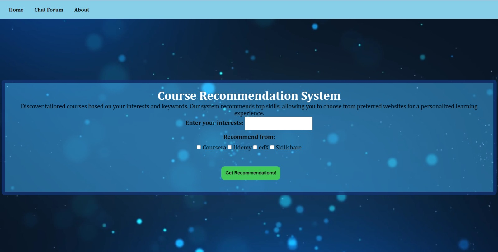
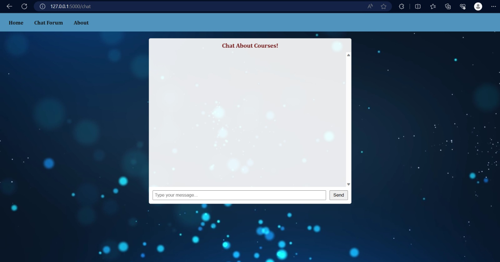
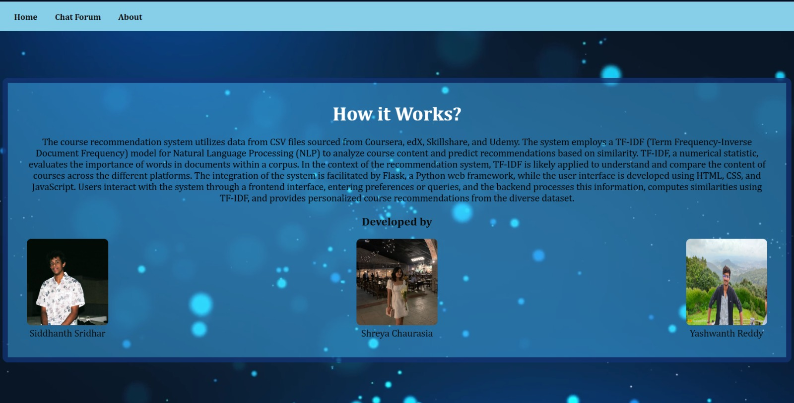

# Course Recommendation System

## Overview
This repository contains the source code for a course recommendation system that utilizes data from CSV files sourced from Coursera, edX, Skillshare, and Udemy. The system employs a TF-IDF (Term Frequency-Inverse Document Frequency) model for Natural Language Processing (NLP) to analyze course content and predict recommendations based on similarity.

## How it Works
- The system utilizes CSV files from Coursera, edX, Skillshare, and Udemy to gather course data.
- TF-IDF (Term Frequency-Inverse Document Frequency) model is employed for NLP to analyze course content.
- TF-IDF evaluates the importance of words in documents within a corpus. In this context, it helps understand and compare the content of courses across different platforms.
- Flask, a Python web framework, facilitates the integration of the system.
- The user interface is developed using HTML, CSS, and JavaScript.
- Users interact with the system through a frontend interface where they can enter preferences or queries.
- The backend processes this information, computes similarities using TF-IDF, and provides personalized course recommendations from the diverse dataset.

## Dataset
The dataset used in this project can be found on Kaggle: Multi-Platform Online Courses Dataset-https://www.kaggle.com/datasets/zeesolver/multi-platform-online-courses-dataset

## Screenshots
### Home Page

### Recommendation Page

### Chat Page

### About Page

Recommendation Page
Chat Page
About Page

## Contributors
- Siddhanth Sridhar(@sidd2305)
- Shreya Chaurasia(@shreyyasiaa)
- Yashwanth Reddy(@yashwanth05)

Feel free to contribute and improve the system!

For any questions or issues, please contact [siddhanth2305@gmail.com](mailto:siddhanth2305@gmail.com).
